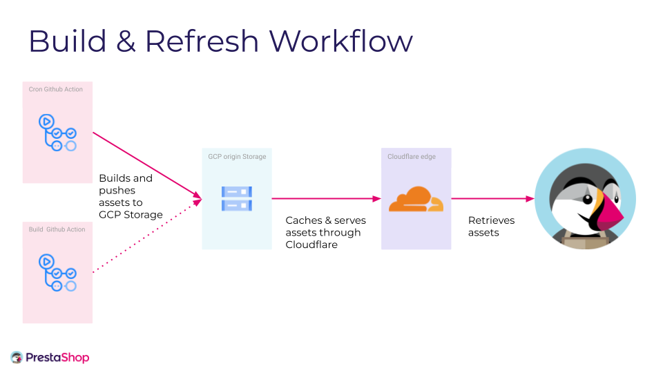

# PrestaShop OpenSource API

## Installation

1. Run `composer install`
2. Get a Github token (with write rights on the repository defined in `config/parameters.yaml`: [https://github.com/settings/tokens/new?description=PrestaShopOpenSourceAPI&scopes=repo](https://github.com/settings/tokens/new?description=PrestHubot&scopes=repo)
3. Create a bucket on GCP and download a [Service Account key file](https://developers.google.com/identity/protocols/OAuth2ServiceAccount#creatinganaccount)

## Usage

### Requirements
You should have 3 environment variables defined:
- `TOKEN` - The Github token required to use the Github API
- `GOOGLE_APPLICATION_CREDENTIALS` - Path to the json file previously downloaded containing the authentication information to use GCP
- `BUCKET_NAME` - The name of the bucket where json files should be uploaded

### Troubleshooting

- If you get a `Bad credentials` error thrown from `GithubExceptionThrower.php` even if your token is correctly configured in parameters.yml, delete the cache folder, in the terminal you can type: `rm -rf var/cache` from the root of the project.

### Main commands

#### Download the module's main files
```shell
$ ./bin/console downloadNativeModuleFiles
```
This will download the main file of the module so the app can extract the module's version and the PrestaShop versions compliance.
It will also download the zip release of the module if it isn't already in the GCP bucket, so it can be added later by the command `uploadAssets`

If you run this command locally for dev purposes and you don't want to plug on the bucket (or don't have the credentials) you can ignore the error with the extra option:
```shell
$ ./bin/console downloadNativeModuleFiles --ignore-bucket-failure
```

#### Download PrestaShop's releases
```shell
$ ./bin/console downloadNewPrestaShopReleases
```
This will download PrestaShop's zip release and the associated xml file so the app can extract the PHP version compatibilities.
(Only releases that are not already in the GCP bucket, or having incomplete associated json file (missing xml file for instance) are downloaded).

#### Update modules' config file
```shell
$ ./bin/console updateModuleConfigFiles
```
This will add new versions of module with their PrestaShop versions compatibility to the repository defined for the key `module_list_repository` in `config/parameters.yaml`

#### Generate json files
```shell
$ ./bin/console generateJson
```
This will generate the different json files to be publicly exposed in the `public/json/` folder

#### Upload generated files to a GCP bucket
```shell
$ ./bin/console uploadAssets
```
This will upload the generated json files as well as the new PrestaShop and module's releases to the GCP bucket

### Utility commands

#### Check that there is no error on the PrestaShop & module's repositories:
```shell
$ ./bin/console checkRepos
```

#### Clean the folder(s) passed as an argument:
```shell
$ ./bin/console clean all|json|modules|prestashop
```

### Everything together
```shell
$ ./bin/console run
```
This will execute the 6 following commands:
- `clean all`
- `downloadNativeModuleFiles`
- `downloadNewPrestaShopReleases`
- `updateModuleConfigFiles`
- `generateJson`
- `uploadAssets`

### Docker

To use this tool with Docker, you have to:
- Build the image: `$ docker build -t distribution-api .`
- Run it with the command you want: `$ docker run --rm -v /path/to/credentials.json:/app/credentials.json -e TOKEN=your_github_token -e BUCKET_NAME=distribution-api -e GOOGLE_APPLICATION_CREDENTIALS=credentials.json distribution-api run`

## Endpoints

`http://<domain.to.public.folder>/modules/<prestashop_version>`<br>
Returns last version of every native module compatible with the specified PrestaShop version

`http://<domain.to.public.folder>/prestashop`<br>
Returns every PrestaShop versions

`http://<domain.to.public.folder>/prestashop/<channel>`<br>
Returns the latest version of the specified channel<br>
`<channel>` can be: `stable`, `rc` or `beta`

`http://<domain.to.public.folder>/autoupgrade`<br>
Returns the PrestaShop version ranges supported by [Update Assistant](https://github.com/PrestaShop/autoupgrade) (`autoupgrade` module) versions

### Environments

There are 3 targeted environment at the moment:

* **Integration**: integration-api.prestashop-project.org
* **Preproduction**: preprod-api.prestashop-project.org
* **Production**: api.prestashop-project.org

Those edge URLs are hosted at the Cloudflare level, proxyfying the origin GCP Storage.

## Architecture



## Workflow

Being on github we'll use the github workflow as follow:


As you can see from the schema above
- add the label "integration-deployment" to a Pull Request to trigger the deployment of the integration environment and be able to test it
- merge a Pull Request against branch `main` to trigger the deployment of the preprod environment and be able to test it
- publish a GitHub release to trigger the deployment of the production environment

### Warning about CI

The `integration-deployment` label, when added to a Pull Request, will run the Integration Workflow which relies on [GitHub secrets](https://docs.github.com/en/actions/security-guides/using-secrets-in-github-actions). These secrets are not available for forks, which means if you add the `integration-deployment` label to a Pull Request whose branch is on a fork, it will fail.

If you wish to test a Pull Request using the `integration-deployment` label, the branch must be on the upstream repository.
